## Flows
- all dto's can be found src/main/java/com/example/dealsplus/dto/

### Auth flows
- Sign up 
  - @PostMapping("/signup") - args: RegisterUserDto
  - 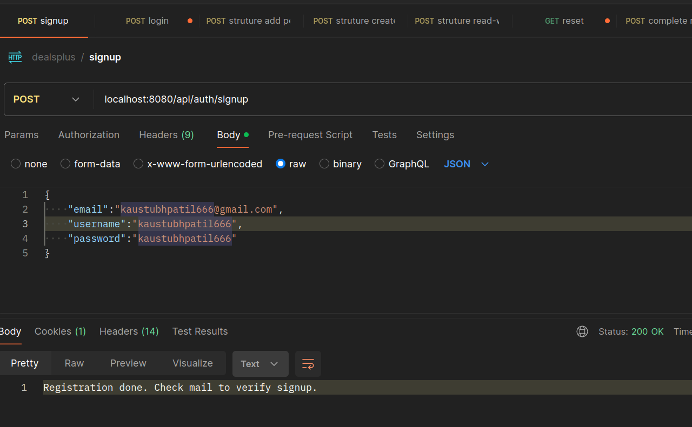 
  - sends a verification mail on mail address. 
  
2. Login disabled case
  - unless the account is verified, the login will fail.
  - 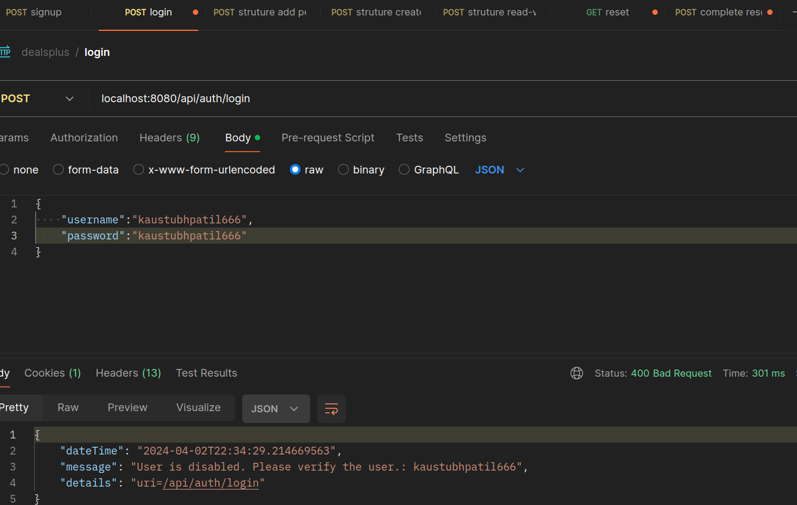

3. Verify Email snip.
  - Use the link in the email to verify/enable the account.
  - 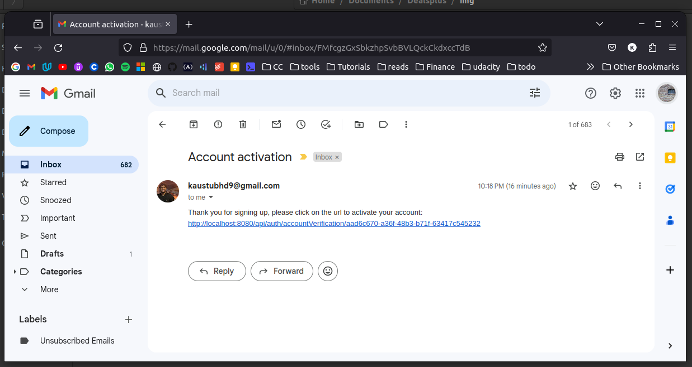

4. Account verified.
  - After the link is clicked, following image opens up.
  - 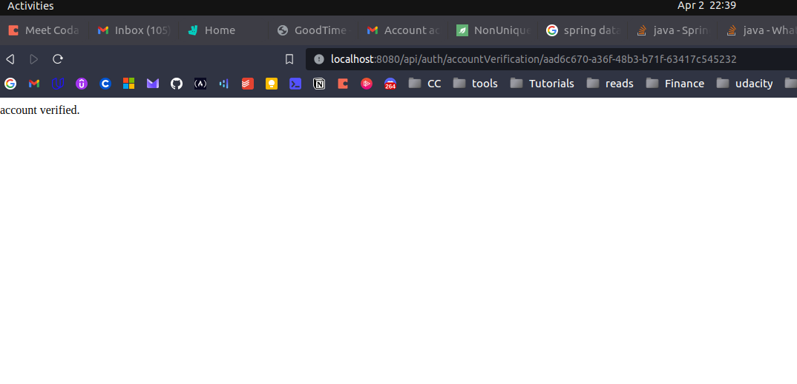

### 5. Incorrect password case
- Trail 1 - fail
  - 
- Trail 2 - fail
  - 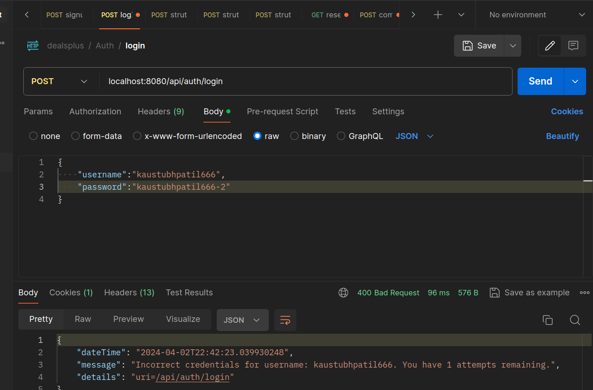
- Trail 3 - fail -> locked.
  - 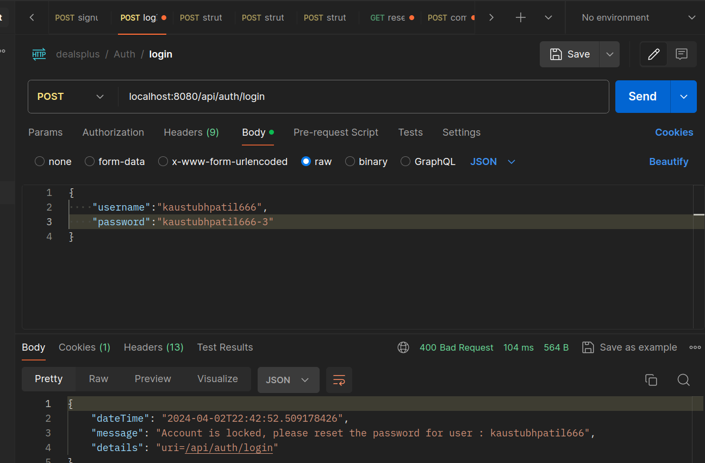
- Test - if account locked, correct password also does not work.
  - 
- Reset password
  - 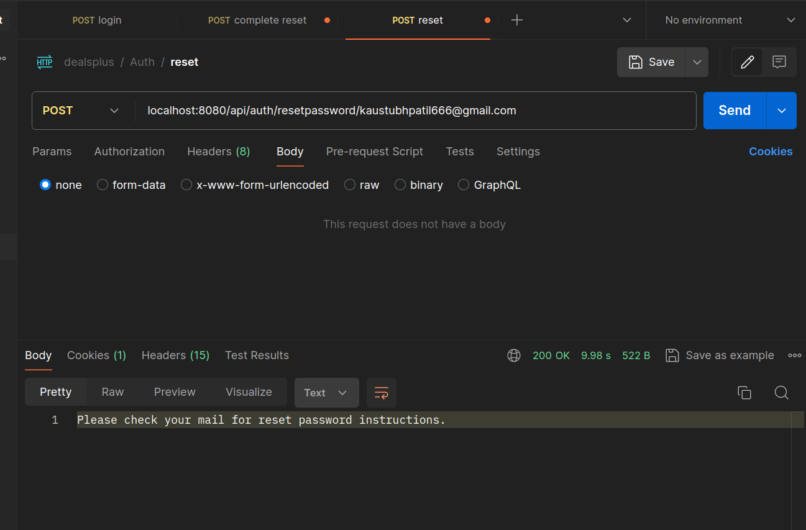
  - post - ("/resetpassword/{email}")
- Reset password mail.
  - 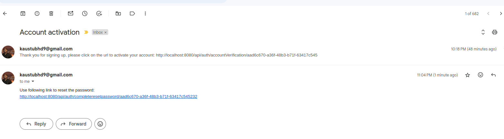
  - each mail has a token -<strong> unique to the user </strong>-. using that url, it's used to reset the password for the following call.
  - baseurl/completeresetpassword/{token}
- Password reset complete.
  - @PostMapping("/completeresetpassword/{token}/{newpassword}")
  - 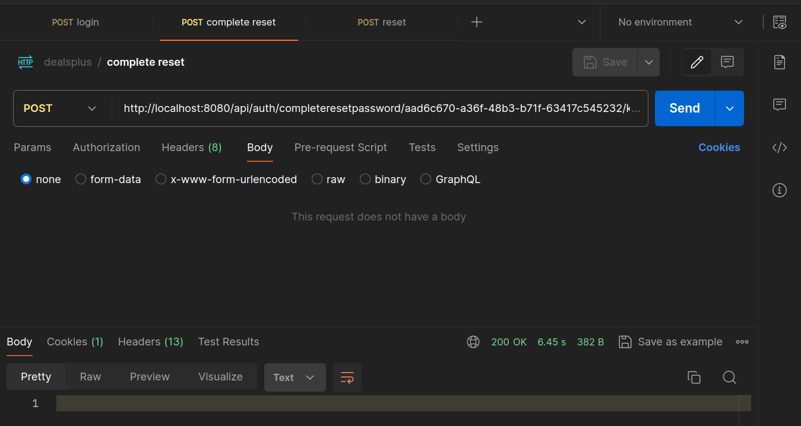

6. Login
   - 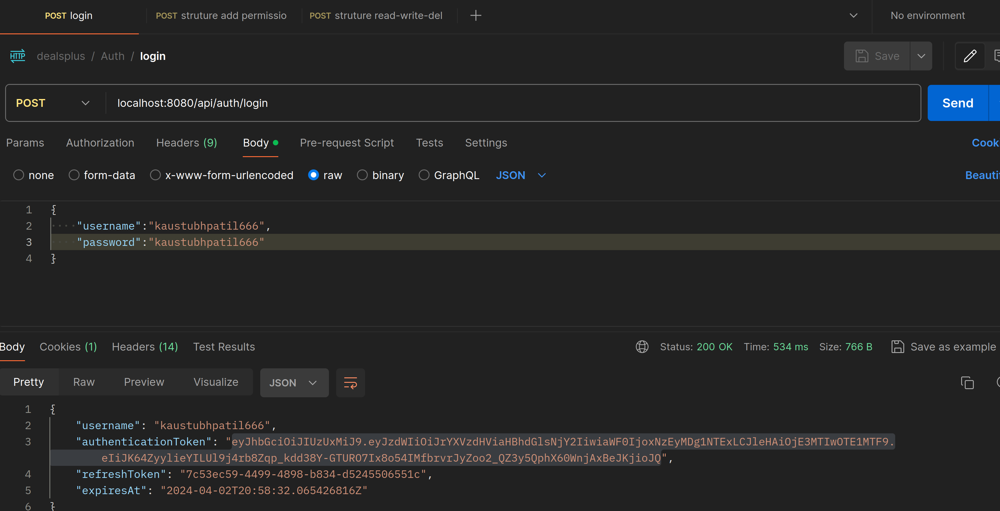

### Structure flows.
1. Structure create @PostMapping("/create")  - args : StructureDto
   - fail case 1 - any non-admin user tries to create a structure.
   - 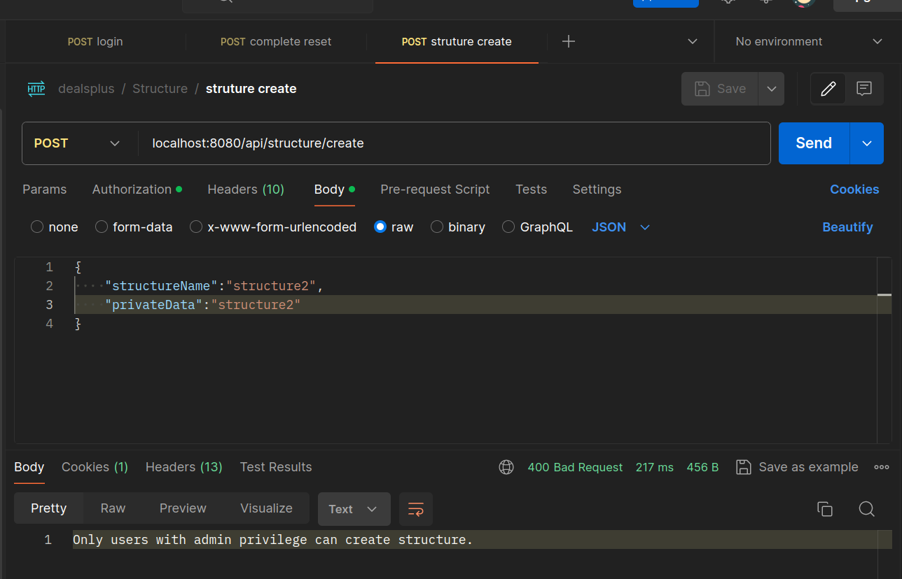
   - fail case 2 - structure with same name is created.
   - mysql> ALTER TABLE structure ADD CONSTRAINT structure_name_unq UNIQUE(structure_name);
   - 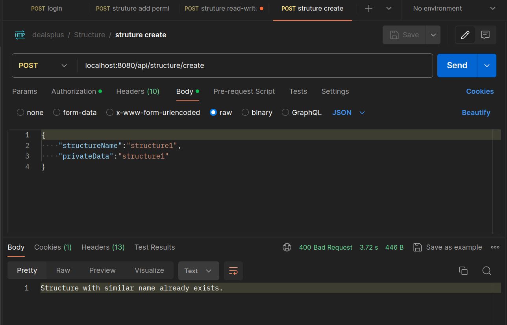
   - structure created.
   - 
   
2. Structure permission flow.
   - Admin user adding structure admin permission to a user for a particular structure.
     - 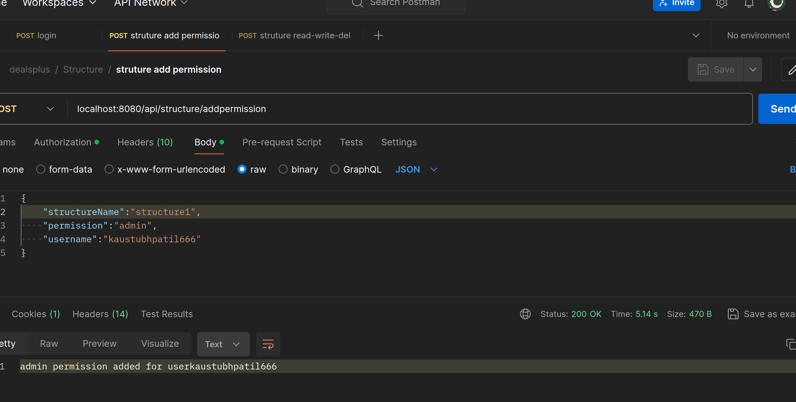
   - User having admin permission for a structure, able to assign specific permissionsMapping for different users for the same structure.
     - read
       - - 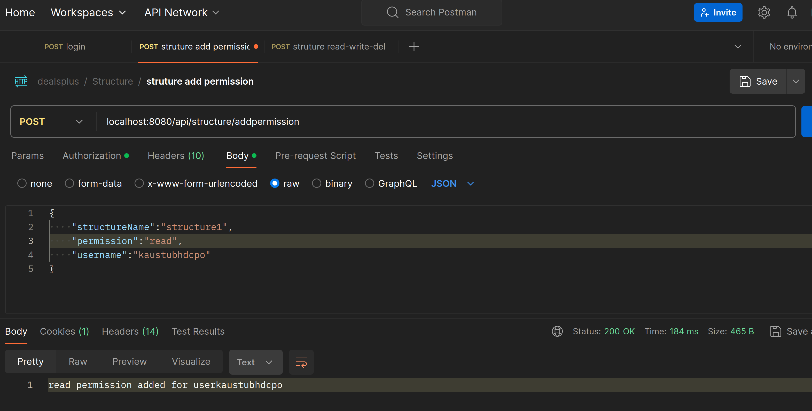
     - write
       - - 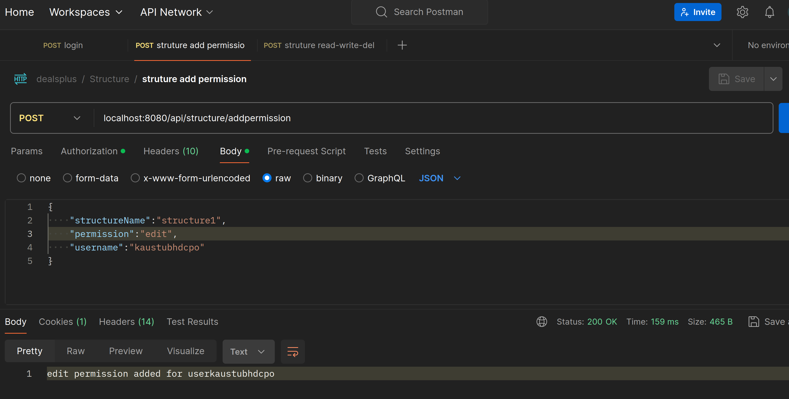
     - delete
       - - 
  - 

Steps:
Setting up gmail for sending mail.
https://www.geeksforgeeks.org/spring-boot-sending-email-via-smtp/

