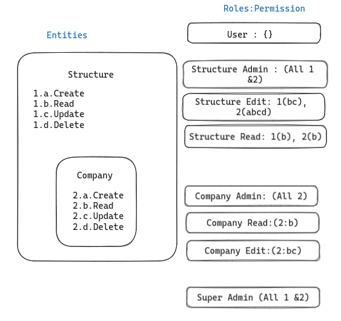
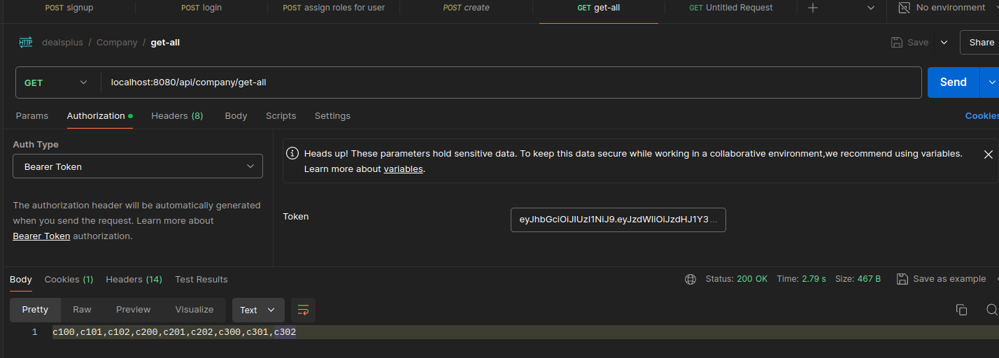

- [Setup \& Steps to Run](#setup--steps-to-run)
- [Project Summary](#project-summary)
- [High Level Diagram](#high-level-diagram)
- [Behaviour](#behaviour)
- [Results](#results)
  - [Operation by structure read role](#operation-by-structure-read-role)
  - [Operations by structure\_edit\_role (write/edit possible)](#operations-by-structure_edit_role-writeedit-possible)
  - [Operations by structure\_admin\_user](#operations-by-structure_admin_user)

#### Setup & Steps to Run
For setup & steps to run, please refer: steps.md

#### Project Summary
Roles and permission handling in spring boot.
- Using jwt for authentication.
- Roles/granted authorities & permissions used for authorization.
- Entities - structures, companies. 
- Structures can contain multiple Companies in them.
- Access control is done on structure & company entity through roles and permissions.

#### High Level Diagram

#### Behaviour
- Details about roles and permissions.
- Role to permission mapping.
- User role has no access for structure/company entity.
- Admin role has super access.

#### Results

##### Operation by structure read role
- Roles assigned
  
- Read all
  
- Read by name
  
- Structure Edit fails due to auth error
  
- Structure Create fails due to auth error
  
- Structure Delete fails due to auth error
  
- Company read pass
  

##### Operations by structure_edit_role (write/edit possible)
- Registration
  
- Login
  
- Roles assigned
  
- Get all structures
  
- Edit done
  
- Delete fails
  
- Create fails
  

##### Operations by structure_admin_user
- Read operation
  
- Create structure operation
  
- Delete structure
  
- Update structure
  
- Get by name
  
