# Roles and permission handling in spring boot.

An entity - structures.
Access control is done on structure entity through roles and permissions.

- Role to permission mapping.
```
USER(USER_ROLE),
STRUCTURE_READ_AUTHORITY("structure:read"),
STRUCTURE_EDIT_AUTHORITY("structure:read,structure:update"),
STRUCTURE_ADMIN_AUTHORITY("structure:read,structure:update,structure:create,structure:delete"),
ADMIN(ADMIN_ROLE);
```

- Admin role has super access.

- With a structure admin role - all CRUD operations are possible on the entity.
- With a structure read role -  all read operations are possible on the entity.
- With a structure edit role -  all write/update operations are possible on the entity.

Users | Create | Read | Update | Delete |
--- |--------|------|--------|--------|
Structure Read | No     | Yes  | No     | No  
Structure Update/Edit  | No     | Yes  | Yes     | No  
Structure Admin  | Yes    | Yes  | Yes     | Yes  

### Operation by structure read role

  ---------


 
- Roles assigned
- -   
- Read all
- - 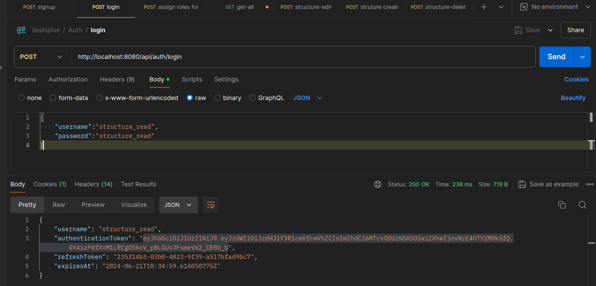

- Read by name
- - 

- Structure Edit fails due to auth error
- - 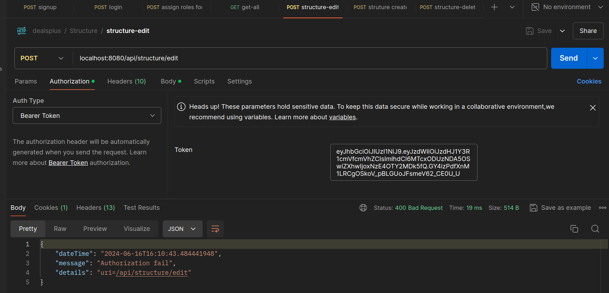

- Structure Create fails due to auth error
- - 

- Structure Delete fails due to auth error
- - 


### Operations by structure_edit_role (write/edit possible)

- Registration
- - 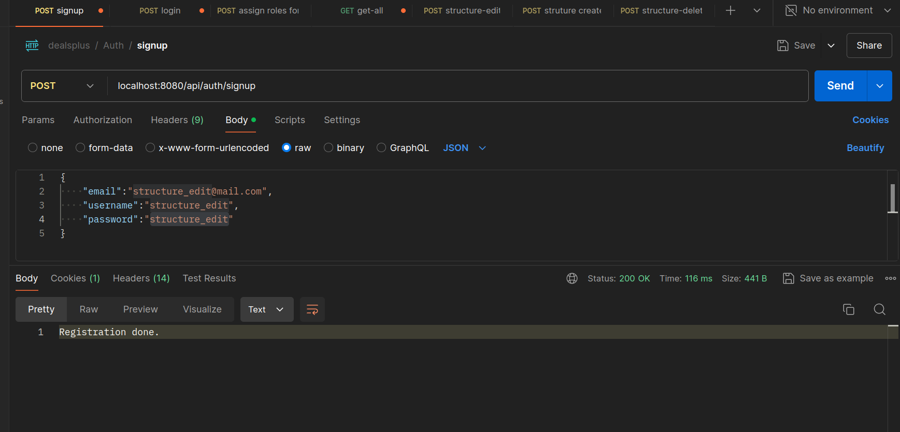

- Login
- - 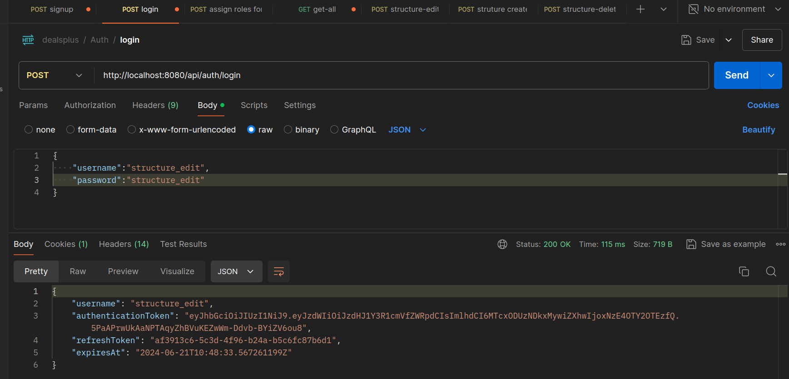

- Roles assigned
- - 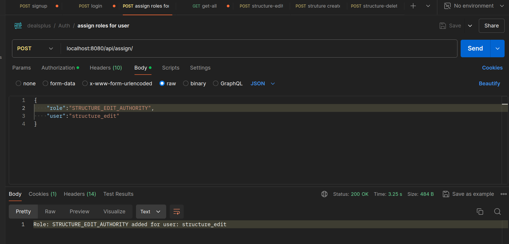

- Get all structures
- - 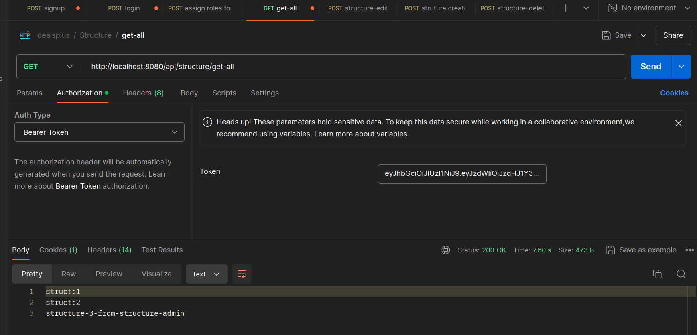

- Edit done
- - 

- Delete fails
- - 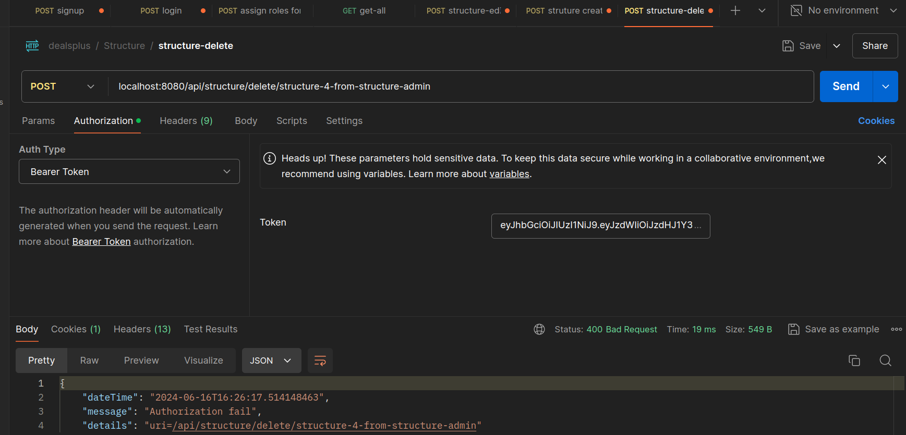

- Create fails
- - 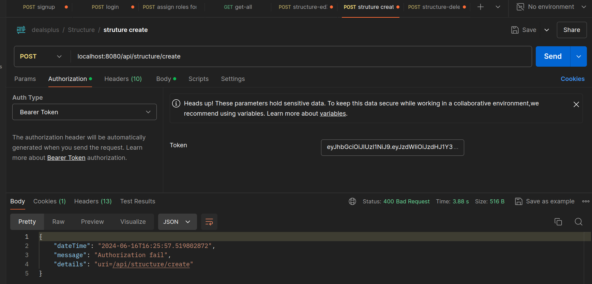

### Operations by structure_admin_user

- Read operation
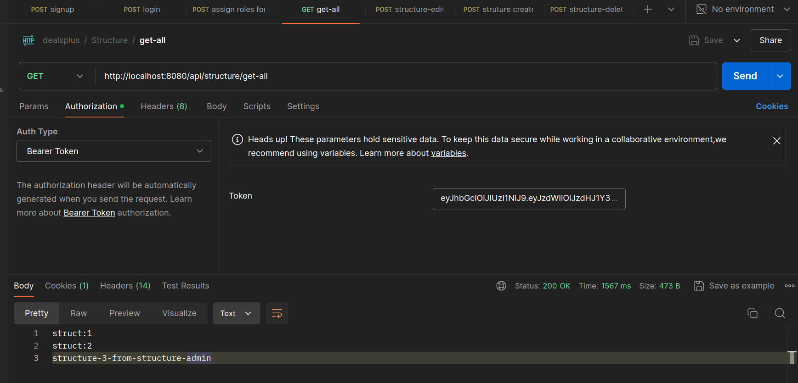

- Create structure operation


- Delete structure
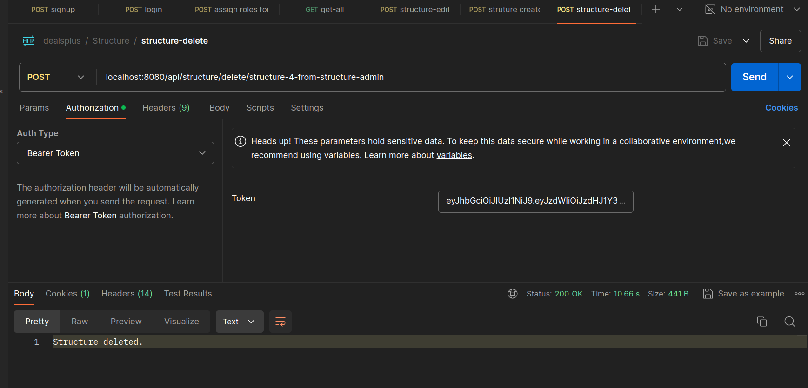

- Update structure
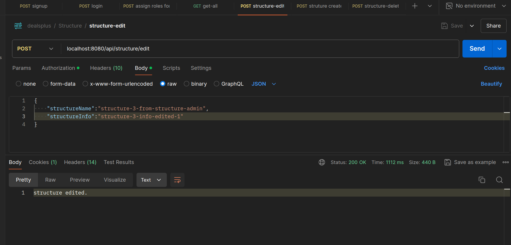

- Get by name
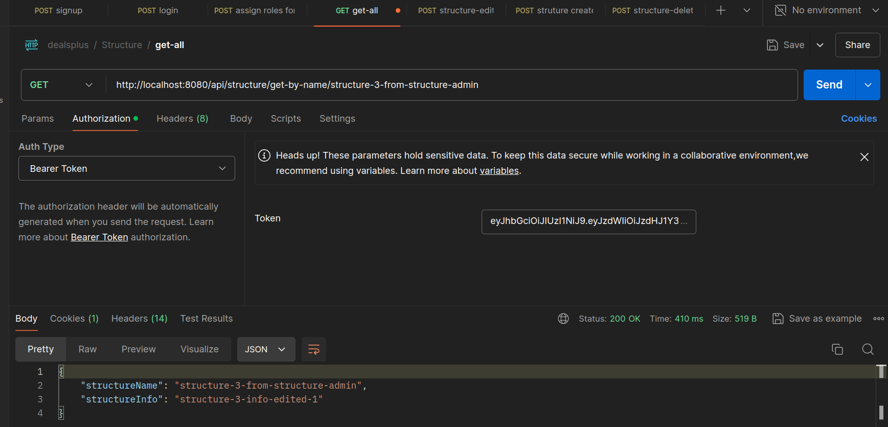


